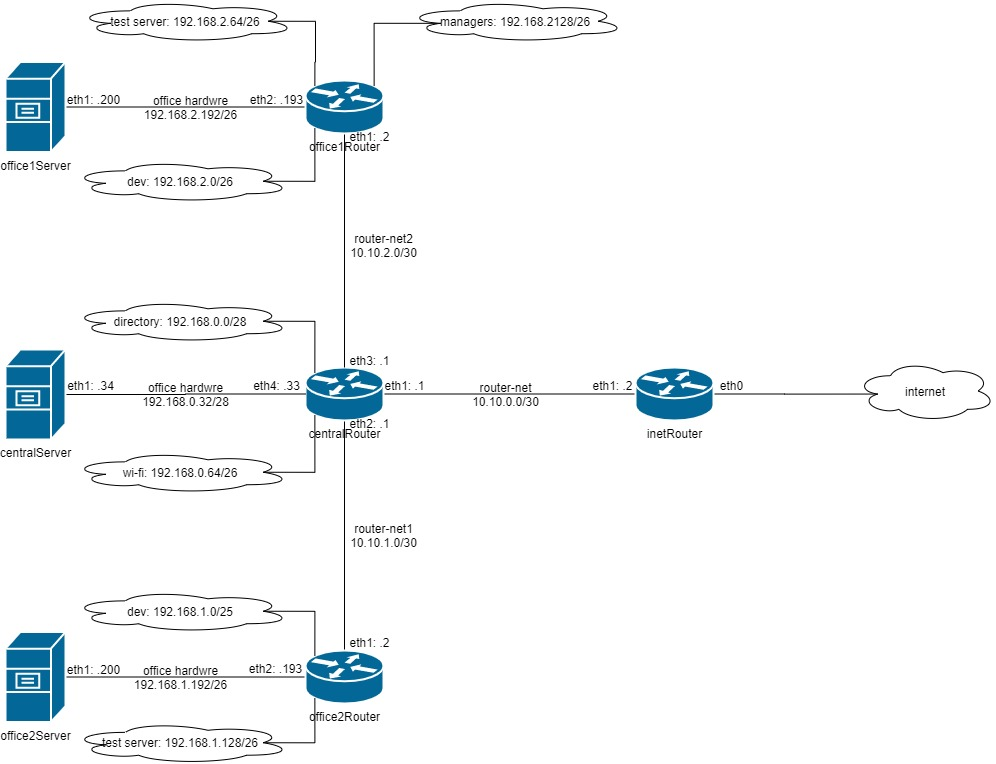

## Стенд для сетевых работ.

#### Планируемая архитектура построить следующую архитектуру

Сеть office1
- 192.168.2.0/26 - dev
- 192.168.2.64/26 - test servers
- 192.168.2.128/26 - managers
- 192.168.2.192/26 - office hardware

Сеть office2
- 192.168.1.0/25 - dev
- 192.168.1.128/26 - test servers
- 192.168.1.192/26 - office hardware

Сеть central
- 192.168.0.0/28 - directors
- 192.168.0.32/28 - office hardware
- 192.168.0.64/26 - wifi

Цель:

### Теоретическая часть
- Найти свободные подсети
- Посчитать сколько узлов в каждой подсети, включая свободные
- Указать broadcast адрес для каждой подсети
- проверить нет ли ошибок при разбиении

### Практическая часть
- Соединить офисы в сеть согласно схеме и настроить роутинг
- Все сервера и роутеры должны ходить в инет черз inetRouter
- Все сервера должны видеть друг друга
- у всех новых серверов отключить дефолт на нат (eth0), который вагрант поднимает для связи
- при нехватке сетевых интервейсов добавить по несколько адресов на интерфейс

#### Теоретическая часть

##### Сеть central

|      Subnet      |      Network      |    HostMin    |    HostMin    |  Hosts/Net  |   Broadcast   |
|------------------|:-----------------:|:-------------:|:-------------:|:-----------:|:-------------:|
| directors        | 192.168.0.0/28    | 192.168.0.1   | 192.168.0.14  |     14      | 192.168.0.15  |
| свободная сеть   | 192.168.0.16/28   | 192.168.0.17  | 192.168.0.30  |     14      | 192.168.0.31  |
| office hardware  | 192.168.0.32/28   | 192.168.0.33  | 192.168.0.46  |     14      | 192.168.0.47  |
| свободная сеть   | 192.168.0.48/28   | 192.168.0.49  | 192.168.0.62  |     14      | 192.168.0.63  |
| wifi             | 192.168.0.64/26   | 192.168.0.65  | 192.168.0.79  |     62      | 192.168.0.127 |
| свободная сеть   | 192.168.0.128/25  | 192.168.0.129 | 192.168.0.254 |     126     | 192.168.0.255 |

##### Сеть office1

|      Subnet      |      Network      |    HostMin    |    HostMin    |  Hosts/Net  |   Broadcast   |
|------------------|:-----------------:|:-------------:|:-------------:|:-----------:|:-------------:|
| dev              | 192.168.2.0/26    | 192.168.2.1   | 192.168.2.62  |     62      | 192.168.2.63  |
| test servers     | 192.168.2.64/26   | 192.168.2.65  | 192.168.2.126 |     62      | 192.168.2.127 |
| managers         | 192.168.2.128/26  | 192.168.2.129 | 192.168.2.190 |     62      | 192.168.0.191 |
| office hardware  | 192.168.2.192/26  | 192.168.2.193 | 192.168.2.254 |     62      | 192.168.0.255 |

##### Сеть office2

|      Subnet      |      Network      |    HostMin    |    HostMin    |  Hosts/Net  |   Broadcast   |
|------------------|:-----------------:|:-------------:|:-------------:|:-----------:|:-------------:|
| dev              | 192.168.1.0/25    | 192.168.0.1   | 192.168.1.126 |     126     | 192.168.1.127 |
| test servers     | 192.168.1.128/26  | 192.168.1.129 | 192.168.1.190 |     62      | 192.168.1.191 |
| office hardware  | 192.168.1.192/26  | 192.168.1.193 | 192.168.1.254 |     62      | 192.168.1.255 |

### Практическая часть

Запустим стенд `vagrant up`

Ссылка на дополнительную информацию
- [Управление сетевыми маршрутами в CentOS 7](https://www.dmosk.ru/miniinstruktions.php?mini=route-centos)
